# ASH//ERROR

> 무너진 도시에서 인공 낙원까지 이어지는 웹 기반 2D 픽셀아트 액션 슈팅 게임

<p align="center">
  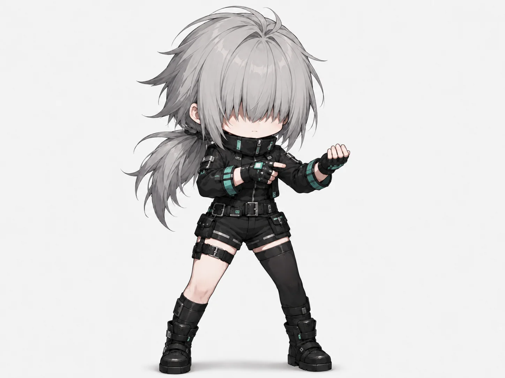
</p>

## 프로젝트 개요

`ASH//ERROR`는 이동, 점프, 대시와 마우스 조준을 결합한 2D 액션 슈팅 플랫폼 게임입니다. 플레이어는 깨끗하지만 텅 빈 미래 도시에서 출발해 뒷골목, 지하 시설, 지옥을 지나 인공 낙원 `THE RETURN`에 도달합니다.

각 방은 전투가 시작되면 봉쇄됩니다. 서로 다른 역할의 안드로이드를 모두 처치하면 다음 포탈이 열리고, 스테이지 마지막에는 고유한 공격 순환과 페이즈 전환을 가진 보스가 등장합니다. 단순히 화력을 높이는 대신 공격 예고를 읽고, 안전 구간을 찾고, 적의 역할에 맞는 무기를 선택하는 전투를 목표로 했습니다.

| 항목      | 내용                                                                                  |
| --------- | ------------------------------------------------------------------------------------- |
| 장르      | 2D 액션 슈팅 플랫폼                                                                   |
| 플랫폼    | 웹 브라우저                                                                           |
| 게임 엔진 | Phaser 4                                                                              |
| UI        | React 19, Zustand                                                                     |
| 언어·빌드 | TypeScript, Vite, pnpm workspace                                                      |
| 검증      | Vitest, Playwright E2E, TypeScript, lint, build                                       |
| 작업 범위 | 게임 기획, 전투·이동 구현, 레벨 디자인, 아트 제작 파이프라인, 오디오 통합, QA, 문서화 |

## 핵심 경험

```text
방 진입 → 전투 공간 봉쇄 → 역할이 다른 적 조합 대응
→ 무기 획득·교체 → 방 클리어 → 보스 패턴 학습 → 다음 스테이지
```

- **다섯 개의 스테이지**: 미래 도시, 뒷골목, 지하, 지옥, 인공 낙원으로 이어지는 시각·음악·전투 변화
- **지상전에서 공중전으로의 확장**: 점프와 발판 중심 전투가 마지막 스테이지에서 자유 비행과 탄막 회피로 전환
- **역할이 분명한 적 구성**: 근접 압박, 원거리 견제, 비행 사격, 포획, 진로 봉쇄, 돌진과 방사 탄막을 조합
- **패턴 중심 보스전**: 공격 예고, 체력 임계점, 약점 노출, 무적 구간과 페이즈 전환으로 구성
- **네 종류의 무기**: 연사, 산탄, 점사, 관통에 특화된 무기를 최대 4개 슬롯에서 즉시 교체

## 세계와 스테이지

스테이지마다 색과 소재만 바꾸지 않고, 이동 방식과 적 역할까지 함께 변화시키는 것을 목표로 했습니다. 밝고 비어 있는 도시에서 시작해 점차 사람이 숨어 사는 공간과 도시의 뒤틀린 기억을 지나도록 구성했습니다.

아래 배경은 모두 ChatGPT 이미지 생성으로 제작한 뒤 게임 화면의 시야, 전투 공간, 캐릭터 가독성을 기준으로 선별하고 WebP로 적용한 실제 게임 에셋입니다. 배경만 보아도 스테이지의 위치와 위험도가 구분되도록 명도와 주조색을 단계적으로 변화시켰습니다.

### 1 // THE CITY

<p align="center">
  
</p>

흰색 건축물과 하늘색 유리, 넓은 시야를 사용한 시작 스테이지입니다. 이동과 조준, 근접 공격 예고, 비행 적 대응을 순서대로 학습시킵니다. 깨끗하지만 사람이 보이지 않는 공간으로 세계의 불안감을 시작합니다.

### 2 // THE BACK ALLEYS

<p align="center">
  
</p>

같은 문명이지만 밤과 낮은 채도, 젖은 바닥과 좁은 구조로 분위기를 바꿨습니다. 구덩이와 발판을 이용한 엄폐, 빨라진 적 배치로 첫 스테이지의 기본기를 압축해 요구합니다.

### 3 // THE UNDERGROUND

<p align="center">
  
</p>

녹색 조명, 습기, 배관과 생활 흔적을 사용해 지상과 다른 밀도를 만들었습니다. 방패형 적, 케이블 포획, 천장 위협을 조합하고 보스의 끌어당기기 패턴을 일반 적이 먼저 보여주도록 설계했습니다.

<p align="center">
  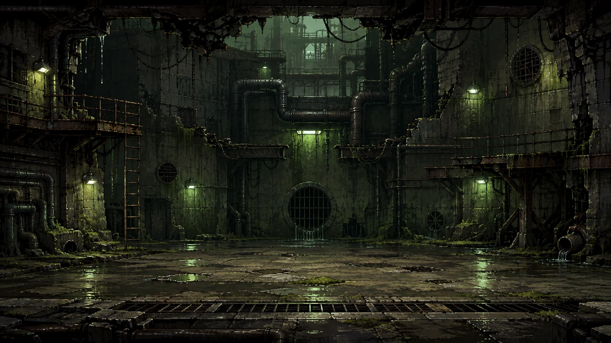
</p>

지하 착지 장면은 상단의 구멍과 빛으로 플레이어가 더 아래로 떨어졌다는 사실을 전달합니다. 이후 포위 전투가 이어지므로 중앙을 비워 캐릭터와 적이 겹쳐도 실루엣이 읽히도록 구성했습니다.

### 4 // HELL

<p align="center">
  
</p>

검은 화산암과 붉은 용암 균열, 돌진선과 지면 분출로 도시의 기억이 공격적인 형태로 변한 공간입니다. 어두운 바위와 발광하는 용암의 대비를 사용해 위험 지점과 전투 캐릭터가 동시에 드러나도록 했습니다.

### 5 // THE RETURN

<p align="center">
  
</p>

흰색·금색·하늘색과 후광·날개·십자 형태를 사용해 인공적인 구원의 이미지를 만들었습니다. 밝고 개방된 배경과 달리 실제 전투는 자유 비행과 방사 탄막으로 가장 높은 압박을 제공하며, 최종 보스의 흰색·금색 실루엣이 묻히지 않도록 하늘색 명암으로 공간의 깊이를 나눴습니다.

## 주인공 디자인과 픽셀 리소스화

주인공은 회색 머리, 검은 전술복, 비대칭 하의와 민트색 포인트를 핵심 식별 요소로 잡았습니다. 원화의 세부 묘사를 그대로 축소하지 않고, 작은 게임 화면에서도 남아야 할 실루엣과 색 대비를 먼저 선택했습니다.

| 콘셉트 아트                                                                       | 게임용 픽셀아트                                                              |
| --------------------------------------------------------------------------------- | ---------------------------------------------------------------------------- |
|  | 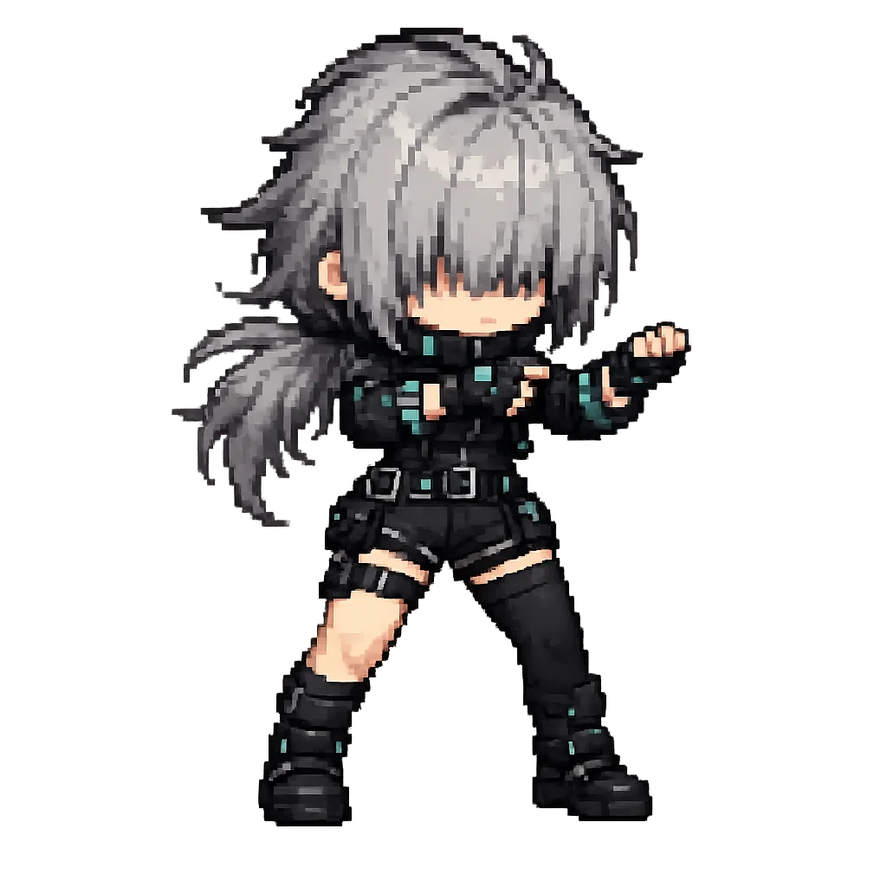 |

### 애니메이션 제작 기준

<p align="center">
  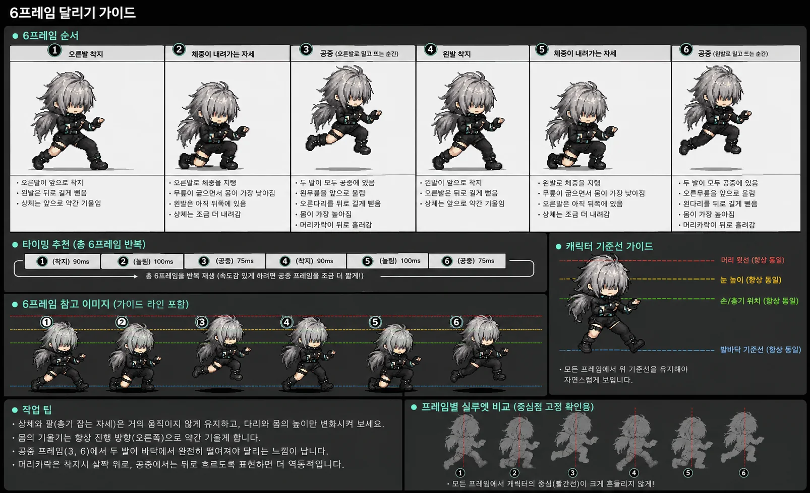
</p>

달리기 애니메이션은 여섯 프레임의 발 순서와 체중 이동을 먼저 정했습니다. 모든 프레임에서 머리 윗선, 눈높이, 손·총기 위치, 발바닥 기준선을 유지하고, 착지와 공중 프레임의 높이 차이만으로 속도감을 만들었습니다.

- 오른발 착지 → 체중 하강 → 공중 → 왼발 착지의 반복 구조
- 상체와 조준 자세는 안정적으로 유지하고 다리와 머리카락에 운동량 집중
- 프레임별 중심점과 장비 위치를 고정해 게임에서 흔들림 방지
- 생성 이미지는 Aseprite에서 축소, 외곽선 정리, 중심점 정렬 후 적용

## 적 디자인: 역할이 외형을 결정하도록

적은 스테이지 분위기를 장식하는 오브젝트가 아니라 플레이어에게 특정 대응을 요구하는 전투 장치로 설계했습니다. 먼저 공격 역할과 상태 전이를 정하고, 그 역할이 실루엣과 장비에서 읽히도록 콘셉트를 제작했습니다.

### 초반: 이동·조준·거리 학습

<p align="center">
  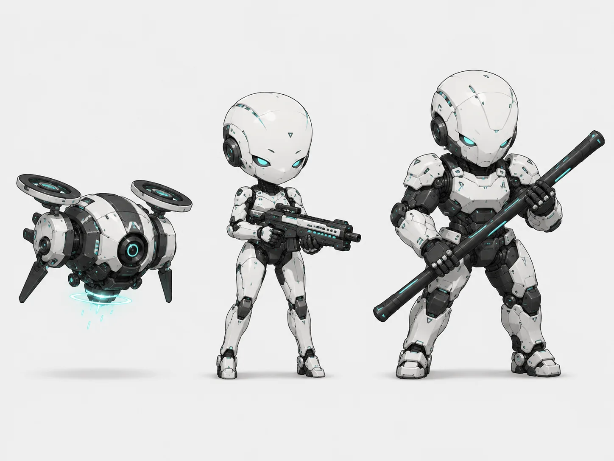
</p>

비행 드론은 수직 조준을, 소총형은 원거리 견제를, 봉을 든 중장갑형은 공격 예고와 회피를 학습시킵니다. 같은 흰색 장갑과 민트색 발광부를 공유하면서 무기와 체형으로 역할을 구분했습니다.

### 탐지·추적형 변주

<p align="center">
  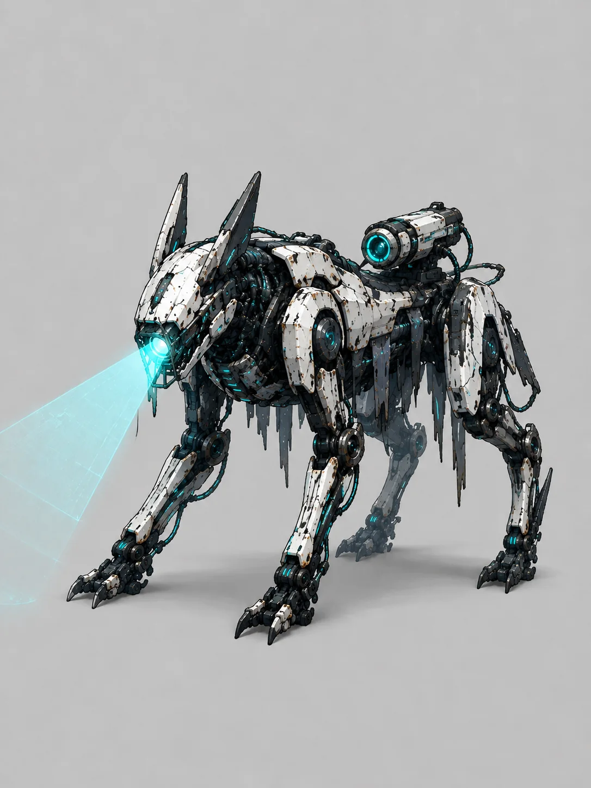
</p>

사족보행 실루엣과 전방 스캐너로 빠른 추적과 탐지 역할을 직관적으로 보여줍니다. 인간형 적과 다른 높이에서 위협을 만들고, 등에 장착된 센서와 전방 광선이 공격 방향을 미리 전달합니다.

### 지하: 포획과 진로 봉쇄

<p align="center">
  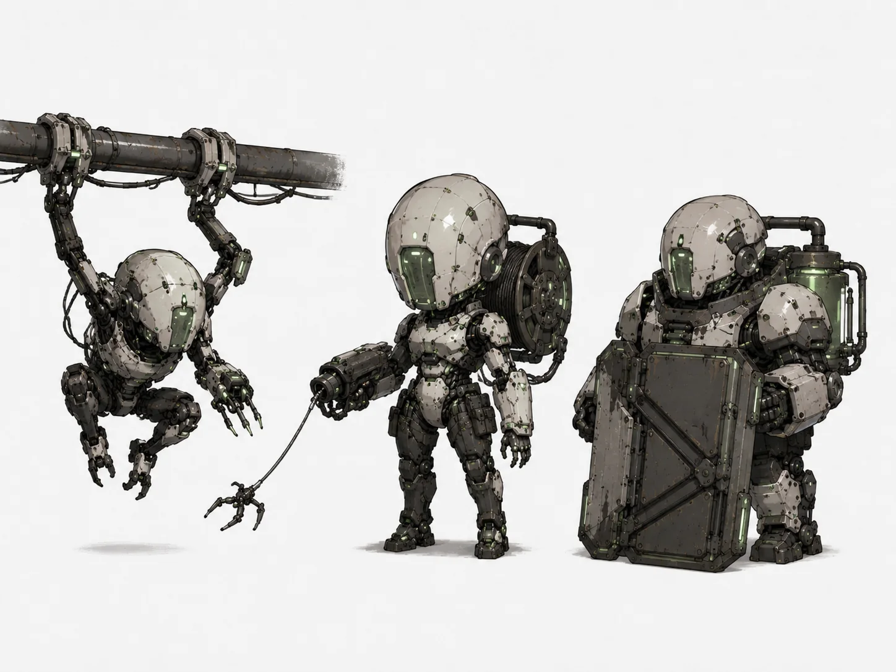
</p>

천장 이동형, 케이블 포획형, 방패형을 한 스테이지에 배치했습니다. 플레이어를 단순히 공격하는 대신 이동 경로를 제한하고 위치를 강제로 바꾸며, 보스전에서 사용할 끌어당기기와 약점 공략을 미리 학습시킵니다.

### 지옥과 인공 낙원: 탄막과 실루엣의 전환

| HELL                                                                                                          | THE RETURN                                                                                               |
| ------------------------------------------------------------------------------------------------------------- | -------------------------------------------------------------------------------------------------------- |
| 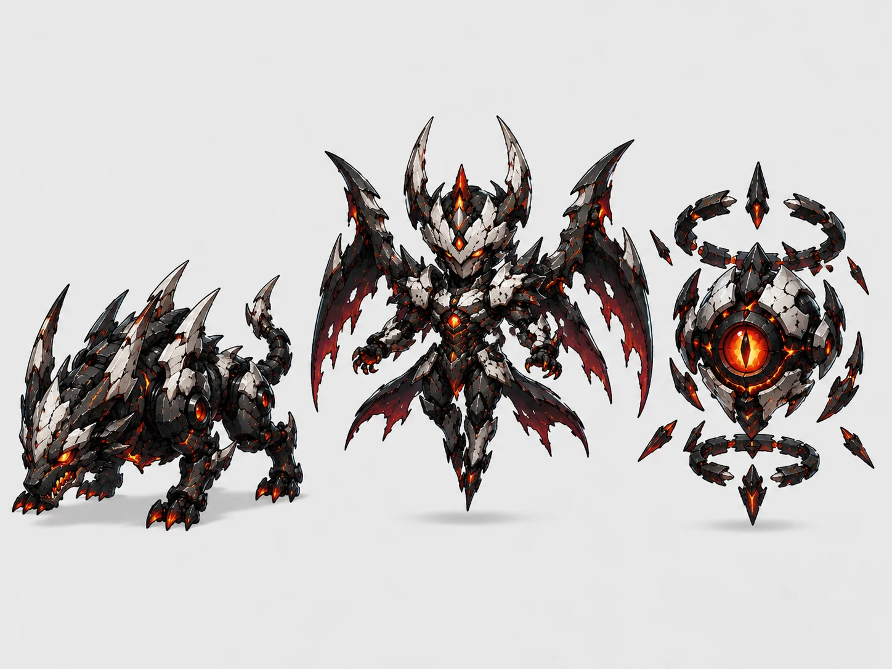 | 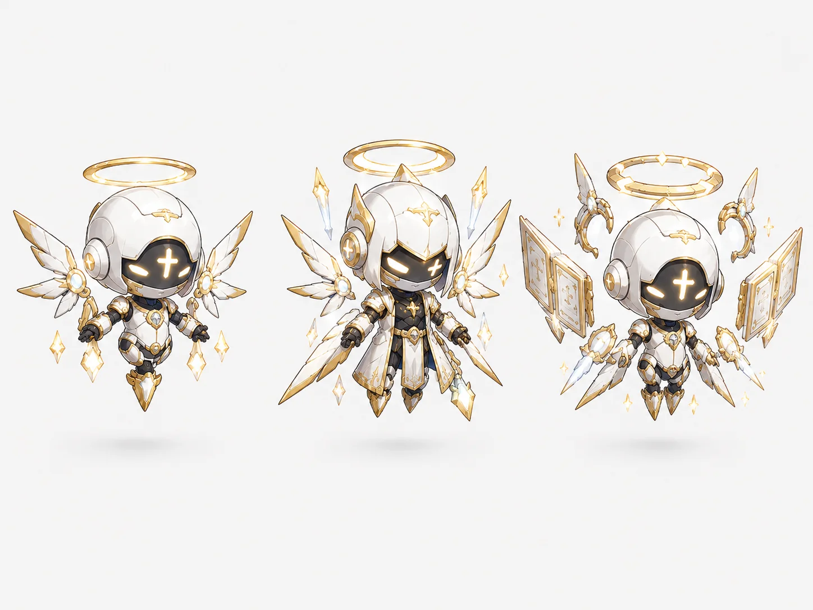 |

4스테이지는 검은 장갑과 붉은 균열, 뾰족한 실루엣으로 돌진과 지면 공격을 강조했습니다. 5스테이지는 둥근 장갑과 후광, 금빛 광선으로 정화와 구원의 이미지를 사용하지만, 전투에서는 편대 이동과 방사 탄막을 사용하도록 대비시켰습니다.

## 최종 보스: 구원을 가장한 기계 천사

<p align="center">
  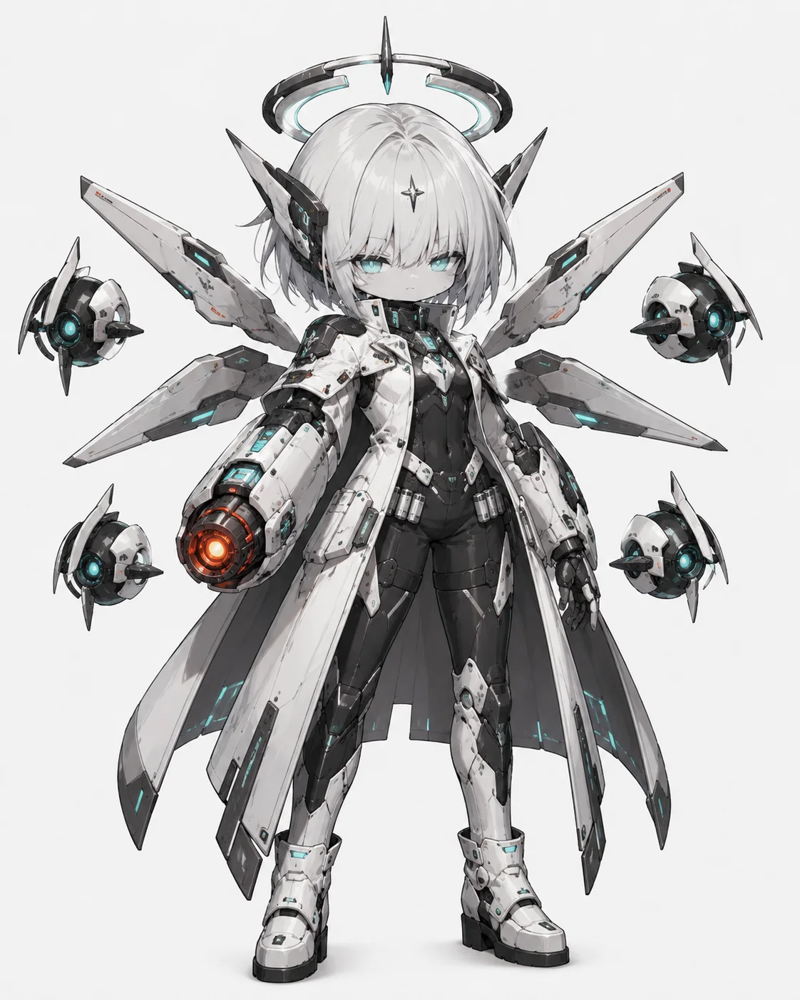
</p>

최종 보스는 흰색·금색 장갑, 하늘색 발광부, 거대한 후광과 기계 날개를 사용합니다. 성스럽고 깨끗한 외형과 플레이어를 제거하려는 기능이 충돌하도록 설계했습니다. 후광, 날개, 단안 코어를 각각 공격 패턴의 중심 장치로 사용해 자세만 보아도 다음 위협을 예측할 수 있게 했습니다.

주요 상태는 `halo-charge`, `halo-fire`, `wings-left`, `wings-right`, `wings-both`, `eye-track`, `eye-fire`, `phase-transition`, `false-salvation`으로 나눴습니다. 코드의 상태명과 에셋 이름을 맞춰 상태 머신과 스프라이트 대응을 단순화했습니다.

### 후광 연출 설계

<p align="center">
  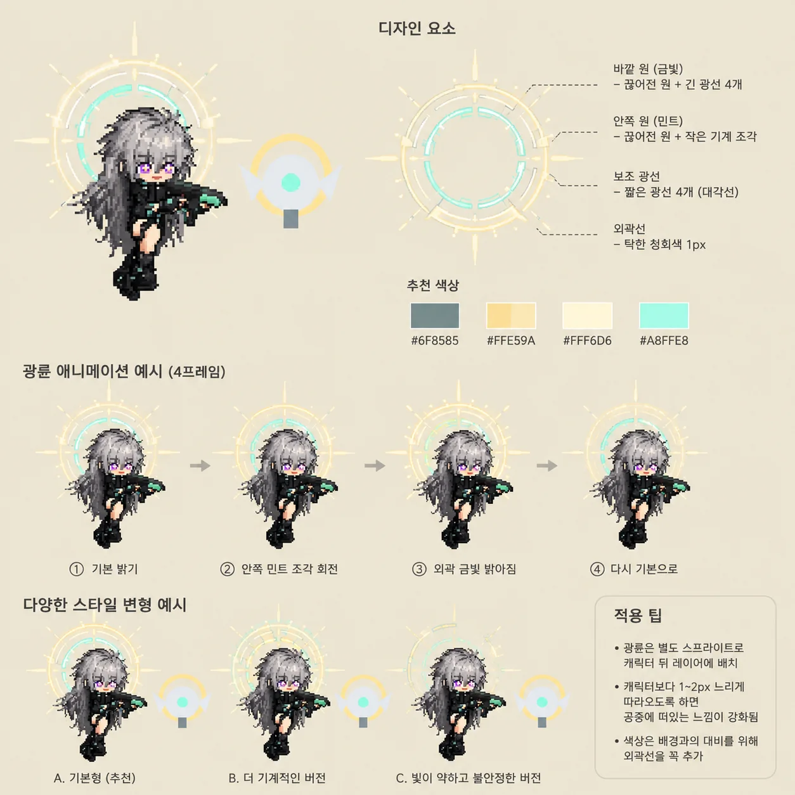
</p>

후광은 캐릭터 뒤의 별도 레이어로 분리하고, 금빛 외곽과 민트색 내부 링의 회전 속도를 다르게 설정했습니다. 캐릭터보다 1~2px 느리게 따라오게 해 공중에 떠 있는 깊이감을 만들고, 외곽선은 밝은 배경에서도 읽히도록 유지했습니다.

## Aseprite를 활용한 게임 스프라이트 제작

`ASH//ERROR`의 스프라이트는 캐릭터 일러스트를 작게 줄이는 작업이 아니라, 게임 상태와 판정 시점을 화면에 전달하는 애니메이션 리소스로 제작했습니다. AI 이미지 생성으로 포즈와 실루엣의 초안을 빠르게 탐색한 뒤, 결과물을 Aseprite에서 직접 수정하고 실제 게임에서 반복 검수했습니다.

### 제작 기준

- 캐릭터의 크기와 신체 비율 유지
- 프레임별 중심점과 발바닥 기준선 통일
- 이동·공격 애니메이션의 자연스러운 연결
- 팔·다리 관절과 기계 부품의 움직임 검토
- 무기, 케이블, 장식과 장비 형태의 일관성 유지
- 투명 배경과 캐릭터 내부의 잘못된 투명 픽셀 정리
- 실제 게임 해상도에 맞춘 크기와 실루엣 조정
- 피격, 사망, 공격 예고 등 상태별 자세 구분

### 한 장의 그림이 아닌 애니메이션으로 설계

각 프레임의 개별 완성도보다 프레임 사이의 연결성을 우선했습니다. 걷기 모션은 왼발 전진과 오른발 전진 자세를 따로 만드는 데 그치지 않고, 두 자세를 반복했을 때 체중이 실제로 이동하는지 확인했습니다. 생성 결과에서 다리 위치가 거의 바뀌지 않거나 관절상 이어질 수 없는 자세가 나오면 사용하지 않았습니다.

프레임을 겹쳐 보며 다리와 관절을 수정하고, 필요한 경우 간단한 포즈 스케치를 새로운 참고 자료로 사용했습니다. 달리기 모션에서는 상체와 조준 자세를 안정적으로 유지하고 착지, 체중 하강, 공중 프레임의 높이 차이로 운동감을 만들었습니다.

### 게임 패턴에서 필요한 상태를 역으로 도출

외형을 먼저 완성한 뒤 모션을 덧붙이지 않고, 실제 공격 순서와 상태 머신을 먼저 설계한 다음 필요한 이미지를 계산했습니다.

| 대상              | 게임플레이 요구                          | 분리한 주요 상태                                                                                                                      |
| ----------------- | ---------------------------------------- | ------------------------------------------------------------------------------------------------------------------------------------- |
| 플레이어          | 이동과 공격, 피격·사망 피드백            | 대기, 이동, 공격, 피격, 쓰러짐, 앞으로 엎드림                                                                                         |
| 3스테이지 보스    | 도약 후 지면 압축 공격                   | 몸 낮추기, 도약, 상승, 체공, 낙하, 내려찍기, 착지                                                                                     |
| 구속형 안드로이드 | 보스의 끌어당기기 패턴 사전 학습         | `idle`, `walk`, 케이블 발사, 끌어당기기, 전기 공격, 피격, 사망                                                                        |
| 최종 보스         | 후광·날개·단안 코어를 이용한 다단계 공격 | `halo-charge`, `halo-fire`, `wings-left`, `wings-right`, `wings-both`, `eye-track`, `eye-fire`, `phase-transition`, `false-salvation` |

3스테이지 보스의 지면 압축 공격은 `몸을 움츠림 → 도약 → 공중에서 다리를 모음 → 낙하 → 지면 충돌 → 복귀`로 나눴습니다. 애니메이션 프레임이 실제 공격 예고, 이동, 판정 발생 시점과 일치하는지 게임에서 확인했습니다.

구속형 안드로이드는 `케이블 발사 → 플레이어 끌어당기기 → 근거리 전기 충격` 순서가 자세만으로도 읽히도록 제작했습니다. 잡몹의 그래픽과 전투 디자인을 함께 설계해 이후 보스전에서 같은 규칙을 자연스럽게 알아볼 수 있도록 했습니다.

### 기계 관절과 부품 일관성 검수

안드로이드와 기계형 적은 프레임마다 팔·다리 관절의 위치와 접히는 방향, 케이블 연결점, 무기 장착 위치, 등과 팔의 장비 개수를 비교했습니다. AI로 여러 자세를 생성하면 부품이 사라지거나 추가되고 손이 다른 구조로 바뀌는 경우가 있어, 원본 스프라이트를 기준 레이어로 두고 직접 수정했습니다.

복잡한 보스는 프레임마다 크기나 중심이 조금만 달라도 게임에서 몸이 흔들리는 것처럼 보입니다. 따라서 프레임을 겹쳐 실루엣과 기준점을 확인하고 다음 질문을 검수 기준으로 사용했습니다.

> - 이 부품이 기존 디자인에도 존재합니까?
> - 손과 관절이 실제로 연결됩니까?
> - 이전 프레임과 같은 캐릭터로 보입니까?

### Aseprite 후처리

| 작업            | 적용 방식                                                                       |
| --------------- | ------------------------------------------------------------------------------- |
| 해상도 조정     | 고해상도 초안을 Nearest Neighbor 방식으로 축소해 픽셀 경계를 유지했습니다.      |
| 도트 정리       | 축소 과정에서 생긴 불필요한 픽셀과 끊어진 외곽선을 직접 수정했습니다.           |
| 프레임 정렬     | 중심점과 발바닥 기준선을 맞춰 재생 중 캐릭터가 흔들리지 않도록 했습니다.        |
| 실루엣 보정     | 작은 화면에서도 머리카락, 팔다리, 무기와 장비가 구분되도록 정리했습니다.        |
| 투명 영역 정리  | 남은 배경과 내부의 잘못된 투명 픽셀을 제거하고 외곽 알파를 확인했습니다.        |
| 애니메이션 확인 | 타임라인에서 반복 재생한 뒤 실제 게임의 속도와 판정 시점으로 다시 검수했습니다. |

## 환경 에셋을 레벨 규칙으로 연결

<p align="center">
  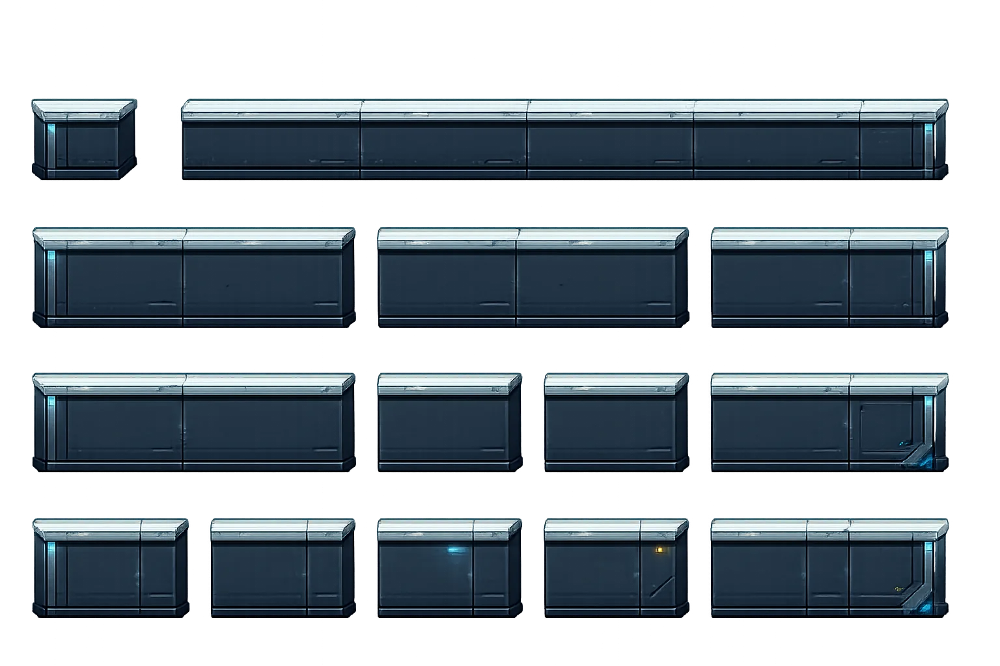
</p>

플랫폼은 한 장의 배경에 구워 넣지 않고 길이와 손상 상태가 다른 모듈로 나눴습니다. 레벨 설정에서 조합할 수 있으면서도 윗면 높이와 옆면 두께, 광원 방향이 달라지지 않도록 기준을 고정했습니다.

- 플레이어가 밟는 윗면은 명확하게 유지
- 발판 길이가 달라도 모서리와 접합부의 두께 통일
- 적 이동과 사격을 가리지 않도록 실루엣 검토
- 스테이지별 팔레트를 적용하되 충돌·도달성 규칙은 공통으로 유지

천장을 따라 움직이는 적이 있는 구간에서는 파이프 이음새가 적 스프라이트 앞으로 튀어나오지 않도록 돌출부를 낮추고 아래쪽 실루엣을 평평하게 수정했습니다. 캐릭터와 환경을 독립된 그림으로 다루지 않고 이동 경로, 레이어 순서, 충돌 영역과 플랫폼 높이를 함께 확인했습니다.

## 제작 파이프라인

```text
게임 패턴 정의
→ 필요한 애니메이션 상태 정리
→ 스프라이트 초안 생성
→ 관절·비율·장비 일관성 검토
→ 문제점 수정 또는 재생성
→ Aseprite 도트 보정과 프레임 정렬
→ 애니메이션 반복 재생 확인
→ Phaser 상태 머신과 좌표계에 연결
→ 실제 플레이에서 발견한 문제 재수정
```

첨부된 캐릭터·몬스터·보스 원화와 제작 가이드는 ChatGPT 이미지 생성 기능으로 만든 초안입니다. 생성 결과를 최종 리소스로 바로 사용하지 않고, 관절과 장비 일관성, 프레임 크기, 투명 영역, 중심점과 게임 내 실제 크기를 검토했습니다. 최종 픽셀 리소스는 Aseprite에서 수작업으로 정리하고 실제 게임 화면에서 다시 확인했습니다.

| 생성형 AI가 담당한 작업             | Aseprite에서 직접 수행한 작업               |
| ----------------------------------- | ------------------------------------------- |
| 새로운 포즈와 공격 상태의 초안 생성 | 게임 규격에 맞춘 크기 조정과 도트 단위 수정 |
| 캐릭터 디자인과 실루엣 아이데이션   | 애니메이션 프레임과 중심점 정렬             |
| 여러 외형과 자세의 빠른 비교        | 관절, 실루엣과 장비 일관성 보정             |
| 기획한 공격 패턴의 시각화           | 투명 영역 정리와 최종 게임 리소스 제작      |

이 과정을 통해 좋은 스프라이트는 한 장의 그림으로 완성되는 것이 아니라는 점을 배웠습니다. 다음 프레임과 자연스럽게 연결되는지, 작은 해상도에서도 공격의 시작과 종료가 읽히는지, 같은 캐릭터의 디자인이 모든 상태에서 유지되는지, 애니메이션과 게임 로직의 타이밍이 맞는지가 중요했습니다. Aseprite 작업을 거치며 픽셀아트를 게임플레이를 전달하는 애니메이션 시스템의 일부로 이해하게 되었습니다.

## 기술 구현과 검증

### React와 Phaser의 역할 분리

- Phaser: 월드, 물리, 플레이어·적, 투사체, 보스 패턴과 화면 연출
- React: HUD, 체력바, 설정, 일시정지, 조작 가이드와 관리자 UI
- Zustand와 이벤트: 게임 상태와 UI 상태를 연결

### 전투와 무기

| 무기          | 설계 의도                      |
| ------------- | ------------------------------ |
| `SMG`         | 빠른 연사와 안정적인 지속 피해 |
| `SHOTGUN`     | 근거리 5발 산탄과 강한 넉백    |
| `BURST RIFLE` | 빠른 3점사와 중거리 집중 사격  |
| `RAIL RIFLE`  | 높은 단발 피해와 관통 공격     |

무기마다 발사 속도, 투사체 속도, 산탄도, 관통력과 반동을 분리했습니다. 강한 단발 무기 하나가 모든 보스 패턴을 건너뛰지 않도록 장갑별 피해 관계와 패턴 노출 시간을 함께 조정했습니다.

### 검증 방식

- 플레이어 이동 성능을 실측해 발판 간격과 점프 도달성 규칙으로 문서화
- Vitest로 상태 전이, 좌표 계산, 무기·투사체와 오디오 이벤트 검증
- Playwright로 게임 부팅, HUD, 입력, 포탈, 스테이지 이동과 반응형 배치 검증
- 헤드리스 실행의 상태 덤프와 실제 플레이 캡처를 함께 사용
- 화면에서 판단할 수 있는 시각 문제는 코드의 추정보다 실제 렌더 결과를 우선

## 문제 해결 사례

### 생성 이미지를 합성하지 않고 런타임 구조를 변경

손과 총을 이미지 생성 단계에서 합치자 양쪽 원본 픽셀이 다시 그려졌습니다. 그래서 앞팔·손, 총, 뒷팔을 별도 스프라이트로 나누고 런타임에서 같은 각도로 회전시키는 구조로 변경했습니다. 시각 결과가 게임 규칙에 맞지 않을 때 코드를 억지로 보정하기보다 에셋과 구조의 책임을 다시 나눈 사례입니다.

### 적과 이미 발사된 탄막의 수명 분리

탄막형 적을 처치하면 이미 발사된 탄환까지 사라지는 문제를 발견했습니다. 적의 생존 시간과 투사체의 생존 시간은 다른 규칙으로 정의하고, 적이 제거된 뒤에도 남은 투사체를 씬 갱신 루프로 인계했습니다. 탄환이 모두 사라지면 구독을 해제하도록 해 게임 규칙과 코드 수명주기를 일치시켰습니다.

### 화면 연출과 오디오의 이벤트 순서 고정

4스테이지 보스 처치 후 보스 소멸, 화면 파괴, 다음 스테이지 음악이 서로 다른 시스템에 흩어져 있었습니다. 이를 `보스 처치 → 쓰러짐·소멸 → 화면 유지 → 화면 파괴 → 완료 후 BGM 시작` 순서로 정리하고 이벤트와 테스트로 고정했습니다.

## 결과와 회고

`ASH//ERROR`는 다섯 개 스테이지, 네 종류의 무기, 역할별 일반 적과 다섯 보스, 지상전에서 공중전으로 이어지는 진행, 최종 보스와 엔딩까지 하나의 웹 게임 흐름으로 완성했습니다.

이 프로젝트에서 가장 중요했던 점은 아트, 레벨, 코드와 오디오를 별도 결과물로 다루지 않은 것입니다. 적의 역할이 외형을 결정하고, 보스 패턴이 애니메이션 상태를 결정하며, 레벨의 이동 규칙이 플랫폼 에셋과 적 배치를 제한하도록 연결했습니다. 생성형 AI는 가능성을 빠르게 탐색하는 초안 도구로 사용했고, 최종 판단은 코드·테스트·Aseprite 보정과 실제 플레이를 통해 내렸습니다.

## 관련 문서

- [프로젝트 README](../../README.md)
- [게임 소개 및 플레이 가이드](../game-guide.md)
- [AI 활용 내역](../ai-usage/ai-usage-report.md)
- [일반 몬스터 패턴](../standard-enemy-patterns.md)
- [보스 패턴](../boss-patten.md)
- [레벨 디자인 규칙](../level-design-rules.md)
- [오디오 에셋과 제작 기록](../audio-assets.md)
